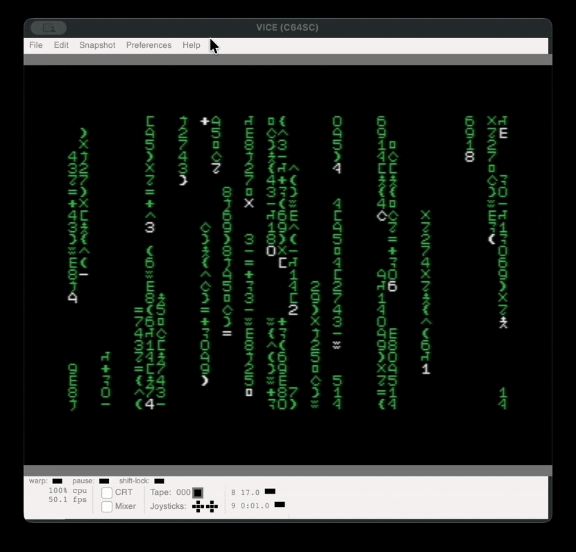

# Digital Rain Effect for the Commodore 64 

This project is a "digital rain" effect demo (created for the movie The Matrix)
targetted for the Commodore 64.

There are two build options

## Requirements for Building

* cc65 installed (includes ca65 assembler).
* Make (for building via the `Makefile`
* Optional: VICE emualtor (x64sc) for testing.

## Building

1. Clone the repository
```
git clone https://github.com/dcgibbons/digital-rain.git
cd digital-rain/c64
```
2. Build the project using the supplied `Makefile`:
```
make
```

This will compile the assembly sources with ca65 and link them into a runnable
binary.

## Running in VICE

1. Run the binary with the VICE 64 emualtor (assumes `x64sc` is in your
   `PATH`):
```
make run
```

## Running on Real Hardware

You can use the `.prg` file (`c64_digital_rain.prg`) with an SD2IEC or other
loader.

To load:
```basic
LOAD "*",8
RUN
```

## Screenshots


